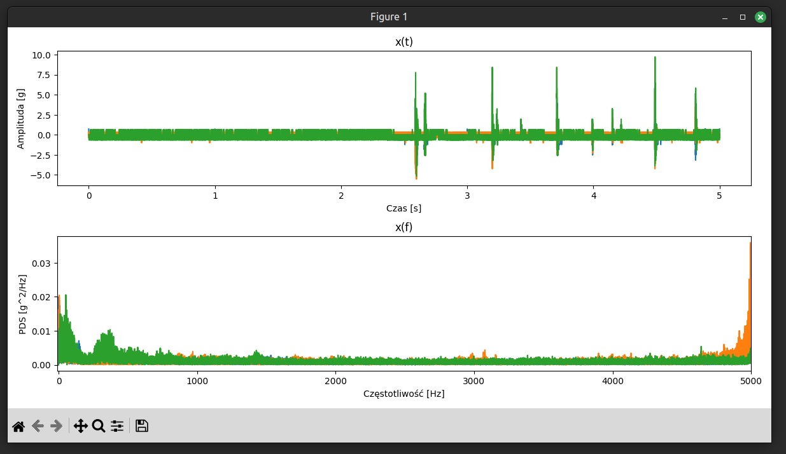

# Vibration Measurement Cubesat Mockup
Code Repository for the mockup of Vibration Measurement Cubesat. User interfaces are in polish language.

## Repo content

- `Firmware_ESP32S3` - firmware for ESP32S3 to measure vibrations from sensors with ADC and send it with USB CDC to the PC,
- `Software_Plotter` - software to load, save and visualize vibration data gathered from the mockup.

## Usage

### Firmware

1. Install and open Platformio in Visual Studio Code,
2. Open `Firmware_ESP32S3` project,
3. Connect ESP32S3 in boot mode (GPIO0 pulled low),
4. Click build and upload.

### Software

1. Download release for Windows or Linux,
2. Run the program, select used sensor type and specify the serial port from the list,
3. Start the data gathering,
4. Conduct the vibration test and click stop.
5. Program shows the plots but additionally saves the readen data in txt file. This file can be opened in this software, just to show the plots.

## Images

## Screenshots

